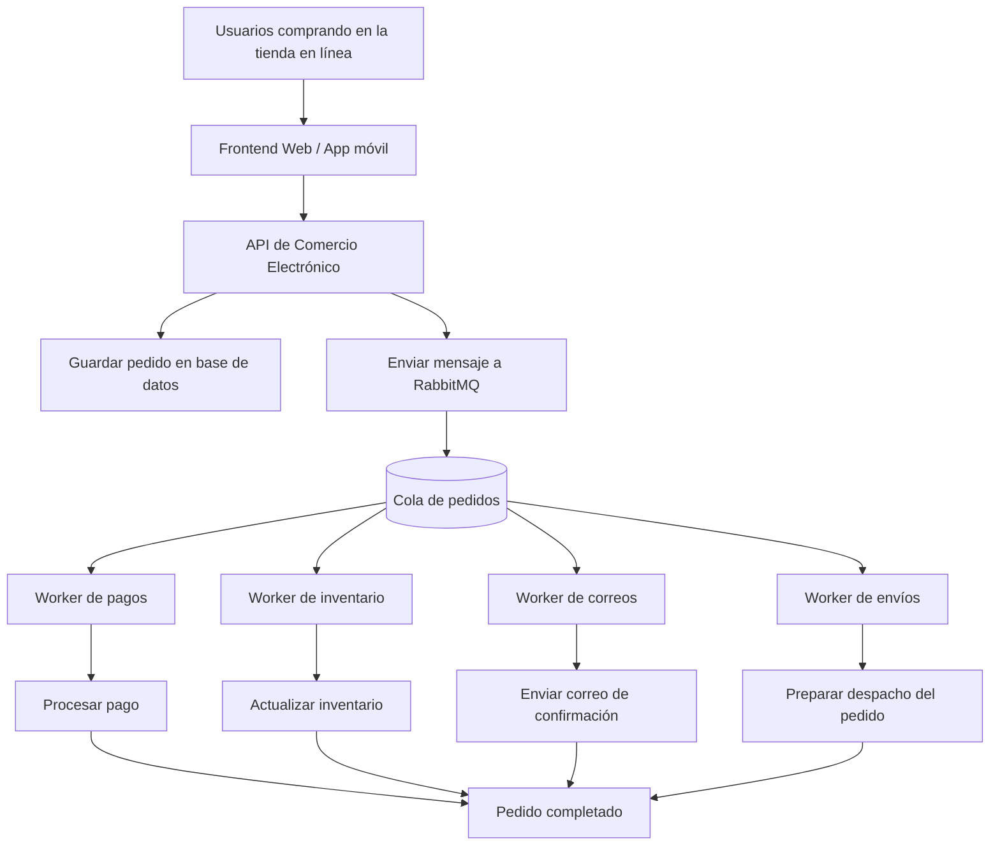

# Parcial de Programación: Colas en Infraestructura de Aplicaciones

## 1. ¿Cómo las colas ayudan a crear aplicaciones altamente escalables?

Una **cola de mensajes** es una estructura que permite recibir, almacenar y entregar tareas o mensajes entre diferentes partes de una aplicación. En lugar de que todos los procesos se ejecuten al mismo tiempo y de forma inmediata, la cola permite que las solicitudes se organicen y sean atendidas poco a poco por otros servicios.

A nivel de infraestructura, las colas ayudan a crear aplicaciones más escalables porque separan a los sistemas que producen solicitudes de los sistemas que las procesan. Esto se conoce como **desacoplamiento**. Por ejemplo, una aplicación puede recibir miles de pedidos al mismo tiempo, guardar esos pedidos en una cola y luego procesarlos con varios trabajadores o servicios en segundo plano.

Esto evita que la aplicación principal se sature, ya que no necesita hacer todo el trabajo en el mismo momento. Además, si aumenta la cantidad de solicitudes, se pueden agregar más consumidores o workers para procesar más mensajes de la cola. De esta forma, la aplicación puede crecer horizontalmente sin depender de un solo servidor.

También ayudan a mejorar la disponibilidad. Si un servicio falla temporalmente, los mensajes pueden quedarse en la cola hasta que el servicio vuelva a estar disponible. Así se reduce la pérdida de información y se mantiene una mejor experiencia para el usuario.

### Ejemplo concreto

Supongamos una aplicación de comercio electrónico. Cuando un cliente realiza una compra, el sistema debe hacer varias tareas:

- Registrar el pedido.
- Verificar el inventario.
- Procesar el pago.
- Enviar una confirmación por correo.
- Notificar al área de envíos.

Si todas esas tareas se hacen al mismo tiempo en la misma solicitud, la aplicación puede volverse lenta o fallar cuando muchos usuarios compran al mismo tiempo.

Con una cola, la aplicación puede registrar el pedido rápidamente y enviar un mensaje a RabbitMQ indicando que hay un nuevo pedido pendiente. Luego, otros servicios se encargan de procesar el pago, actualizar el inventario y enviar el correo de confirmación. Esto permite que la aplicación atienda más usuarios simultáneamente y que cada tarea se procese de forma ordenada.

---

## 2. Diagrama: uso de RabbitMQ en una aplicación de comercio electrónico

El siguiente diagrama muestra cómo RabbitMQ puede ayudar a una aplicación de comercio electrónico a recibir una mayor cantidad de solicitudes simultáneas.

### Explicación del diagrama

En este diseño, los usuarios realizan compras desde una página web o aplicación móvil. Esas solicitudes llegan a la API de comercio electrónico, que registra el pedido y luego envía un mensaje a RabbitMQ.

RabbitMQ funciona como intermediario entre la API principal y los servicios que realizan tareas pesadas. Los mensajes se almacenan en una cola de pedidos y después son procesados por diferentes workers.

Cada worker se especializa en una tarea específica. Por ejemplo, un worker puede encargarse de procesar pagos, otro de actualizar inventario, otro de enviar correos y otro de preparar el envío del pedido.

Gracias a esta arquitectura, la aplicación puede recibir muchas solicitudes al mismo tiempo sin que la API principal tenga que procesar todo inmediatamente. Si llegan más pedidos, se pueden agregar más workers para consumir mensajes de la cola y procesarlos más rápido.

---

## Conclusión

Las colas como RabbitMQ ayudan a construir aplicaciones más escalables, resistentes y organizadas. En una aplicación de comercio electrónico, permiten manejar muchas compras simultáneas, distribuir tareas entre varios servicios y evitar que el sistema principal se sobrecargue.

El uso de colas mejora el rendimiento porque las tareas pesadas se procesan en segundo plano. También mejora la tolerancia a fallos, ya que los mensajes pueden permanecer en la cola hasta que los servicios estén disponibles para procesarlos.

> Nota: Si el proyecto utilizó Kafka o Amazon SQS en lugar de RabbitMQ, el mismo concepto se mantiene. La diferencia principal está en la herramienta usada para almacenar y distribuir los mensajes.
